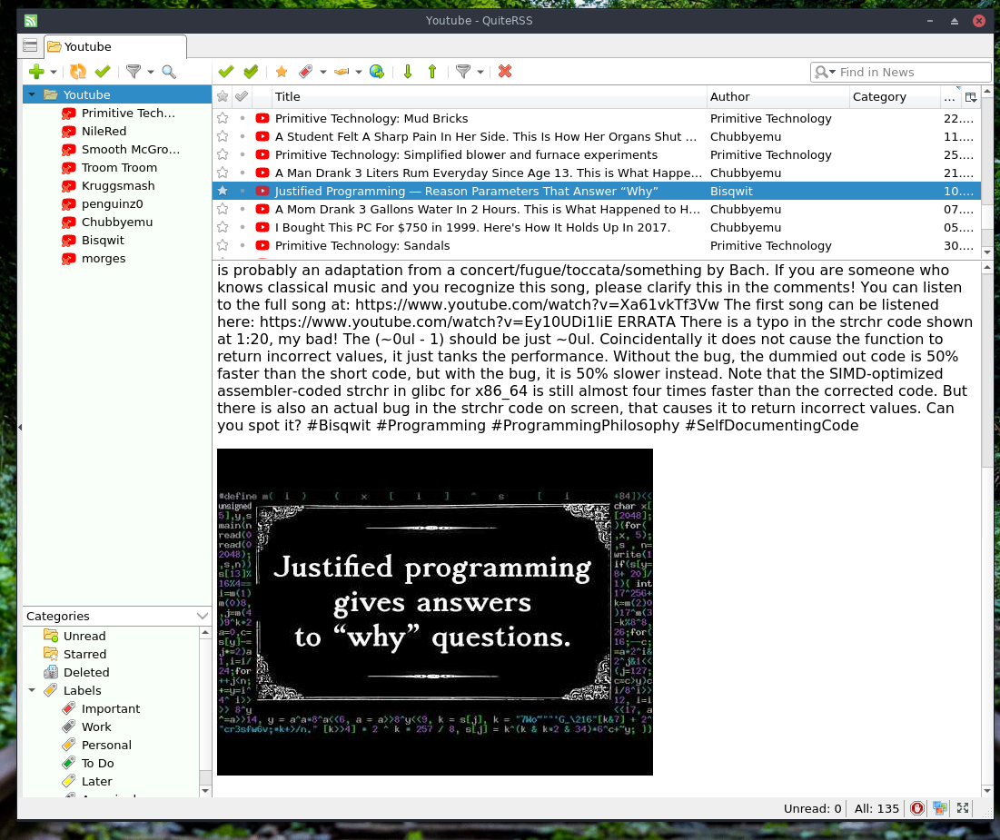

# rss-tube

How to subscribe to youtube channels using RSS! without an account. The idea came up on IRC but I don't know who thought of it, sorry!

To subscribe to a channel you add a RSS link to an RSS feed reader. Then you will see a thumbnail and description of each new video when they are posted. You can click it to open in your browser.

I recommend https://quiterss.org/ `pacman -S quiterss` on arch linux. because it displays the preview well. And you paste a youtube link into the following script, then add that XML link to the program.



## yt2rss Script

This script quickly converts a youtube link into an RSS link on the command line.

https://www.quora.com/How-do-I-get-the-RSS-feed-for-a-YouTube-channel

```
#!/bin/bash

function yt2rss() {
	if [[ "$1" =~ .*youtube.com\/channel.* ]]
	then
		CHANNEL_ID=$(echo "$1" | sed -ne 's/^.*youtube.com\/channel\/\([^\/]*\).*/\1/p')
		echo "https://www.youtube.com/feeds/videos.xml?channel_id=${CHANNEL_ID}"
	elif [[ "$1" =~ .*youtube.com\/user.* ]]
	then
		USERNAME=$(echo "$1" | sed -ne 's/^.*youtube.com\/user\/\([^\/]*\).*/\1/p')
		echo "https://www.youtube.com/feeds/videos.xml?user=${USERNAME}"
	else
		echo playlist not implemented yet
	fi
}

function test() {
	yt2rss "https://www.youtube.com/channel/UCAL3JXZSzSm8AlZyD3nQdBA"
	yt2rss "https://www.youtube.com/user/kruggsmash/videos"
	yt2rss "https://www.youtube.com/user/kruggsmash"
	# echo "https://www.youtube.com/feeds/videos.xml?playlist_id=${PLAYLISTNUM}"
}

yt2rss "$1"
```
