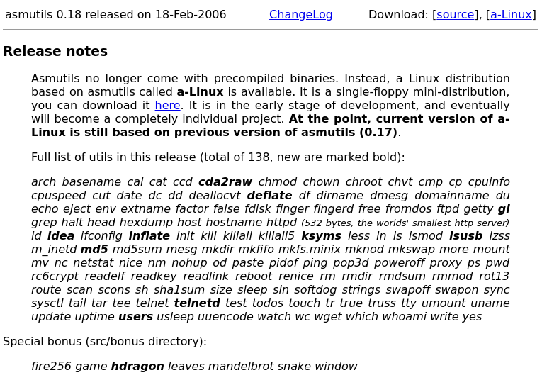
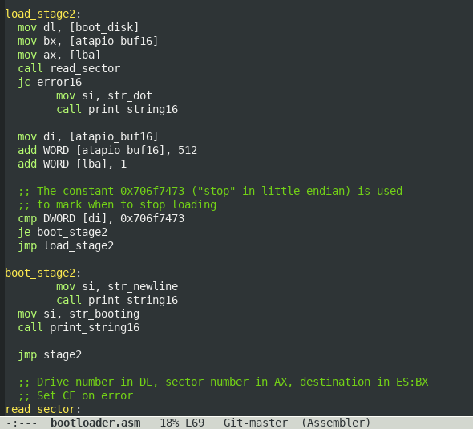
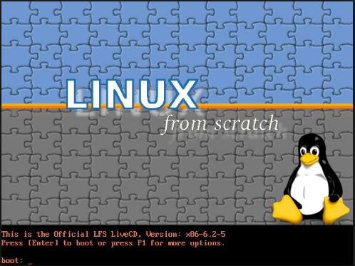
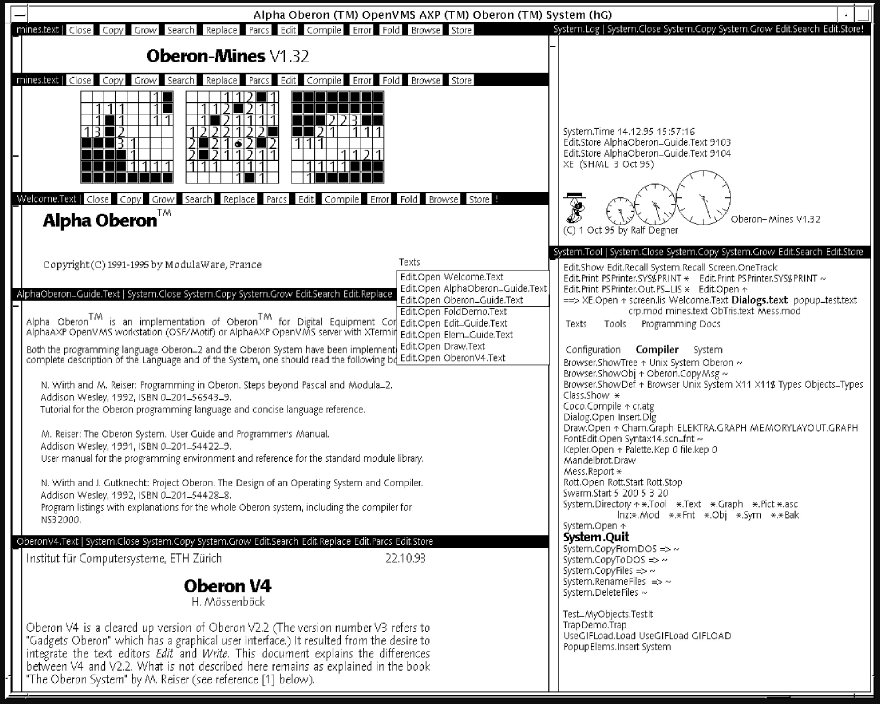
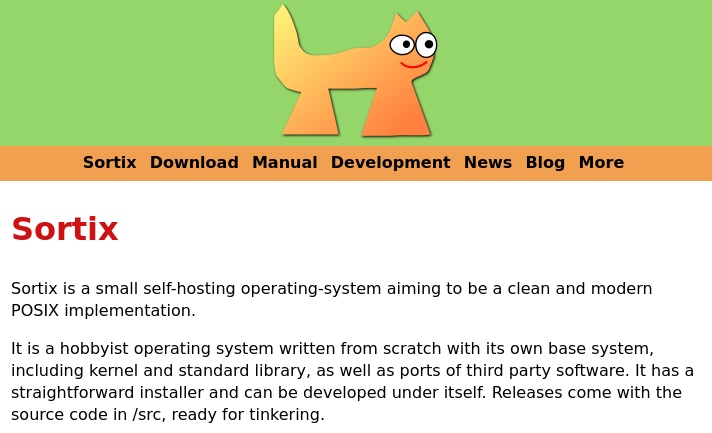
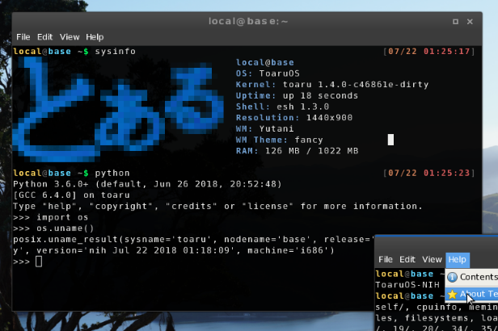
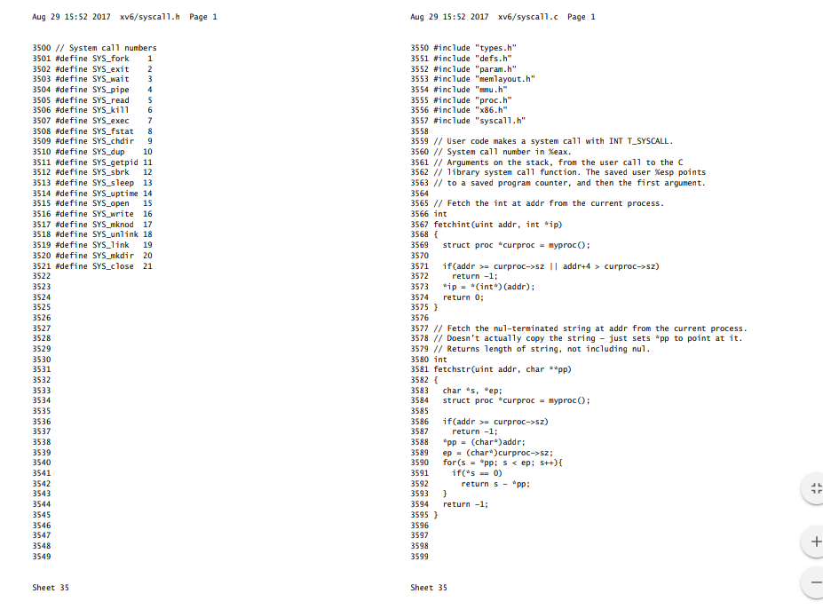

# Bootstrapping relevant OS's

## a-Linux

* http://asm.sourceforge.net/asmutils.html

a-Linux is a linux distribution implemented entirely in assembly, except for the linux kernel itself. It has a reasonably complete set of the standard userspace programs. This could be a good minimal platform to build things on, to ensure you are not making any implicit assumptions about C or libc. 42k lines of asm. GPL2.

## asmc

* https://gitlab.com/giomasce/asmc

Built up from assembly, a series of programming languages are used to create a bootable kernel that runs an interpreter or compiler in order to build proceeding stages. Very promising! 9 asm, 11k g, 3k c. GPL3.

## KolibriOS

TODO

## LFS

This is actually a book that explains how to build a detatched gcc compiler toolchain and then use it to build a complete linux distribution entirely from scratch. This process will be very important if one wishes to go from a non-linux OS that can run GCC to a linux OS. millions of lines of code. Primarily GPL.

## MikeOS

TODO

## Oberon OS

TODO.

## Sortix

* https://sortix.org/

Sortix is a complete implementation of a POSIX OS from scratch in C (kernel in C++). GCC can be used on it. 169k lines of code. ISC License.

## ToaruOS

* https://gitlab.com/toaruos/toaru-nih
* https://toaruos.org/
* https://gitlab.com/toaruos/misaka

ToaruOS is very complete with graphics, networking, package manager. It can run python. Implemented in C. 55k lines of code. University of Illinois/NCSA Open Source License.

## Xv6

* https://pdos.csail.mit.edu/6.828/2017/xv6.html
* https://github.com/mit-pdos/xv6-public

This is a very basic UNIX OS implemented in C. It was developed for the purpose of teaching. The code is clear and it doesn't have rough edges. 8k lines of code. MIT License.

