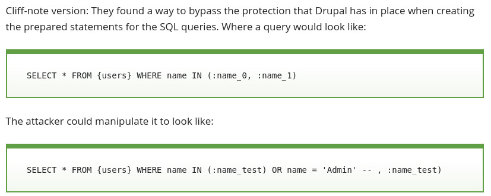

# Code Injection

## Drupalgeddon (2014)

```
diff --git a/includes/database/database.inc b/includes/database/database.inc
index f78098b..01b6385 100644
--- a/includes/database/database.inc
+++ b/includes/database/database.inc
@@ -736,7 +736,7 @@ abstract class DatabaseConnection extends PDO {
     // to expand it out into a comma-delimited set of placeholders.
     foreach (array_filter($args, 'is_array') as $key => $data) {
       $new_keys = array();
-      foreach ($data as $i => $value) {
+      foreach (array_values($data) as $i => $value) {
         // This assumes that there are no other placeholders that use the same
         // name.  For example, if the array placeholder is defined as :example
         // and there is already an :example_2 placeholder, this will generate
```

* [https://www.drupal.org/files/issues/SA-CORE-2014-005-D7.patch](https://www.drupal.org/files/issues/SA-CORE-2014-005-D7.patch).

was all it took to fix one of the most serious drupal security vulnerabilities of all time. It left millions of sites open to be completely taken over. You can see a breakdown of what was seen in the wild over at [malwarebytes.com/drupalgeddon-client-side-attacks](https://blog.malwarebytes.com/threat-analysis/2018/05/look-drupalgeddon-client-side-attacks/). It's even possible that the panama papers were aquired thrugh this bug ([details](https://drupal.sh/drupal-panama-papers-leaks-mossack-fonseca.html)).

This was an SQL code injection attack



(image taken from [blog.sucuri.net](https://blog.sucuri.net/2014/10/highly-critical-sql-injection-on-drupal.html).)

It's worth pointing out that this is an SQL injection attack that happened even though drupal uses PDO/prepared queries. It was because they extended PDO with their own insecure code. PDO/Prepared queries aim to stop SQL injection by taking the task escaping and quoting user inputs away from the developer.

## XSS in HTML

Another extremely common type of code injection attack is XSS, where an attacker is able to somehow trick a webapp into inserting new javascript code into a webpage. This is a serious problem beyond just making alert boxes pop up, it's possible to steal cookies and log in as other users (such as the site admin) or manipulate accounts.

XSS is possible when the web application doesn't properly escape user input when rendering it onto a page. Another important property that makes this possible is the fact that the web allows javascript inside HTML at all. It would be much harder to do XSS if all javascript was required to come from a `script src=` file.

Another property of HTML that doesn't help at all is that user input requires 2 different kinds of escaping depending on context. HTML templating - as opposed to text templating - is one of the ways to take the task of using the context dependent correct type of escaping away from the programmer, meaning more secure applications. It's a huge help but of course it isn't perfect either, see [here](https://github.com/golang/go/issues/15399) and [here](https://github.com/golang/go/issues/27926).

# Code reuse

## Drupalgeddon 2, 3, ... (2018, 2019)

Since then there have been new "Drupalgeddons", for example [research.checkpoint.com - Uncovering Drupalgeddon 2 (CVE-2018-7600)](https://research.checkpoint.com/uncovering-drupalgeddon-2/) and the newest one (in chinese) [Drupal SA-CORE-2019-003](https://paper.seebug.org/821/).

It was a `unserialize` exploit. The PHP `unserialize` function is a bit like a powered up version of `JSON.parse`, it takes in some text and produces an object - but unlike with JSON (which is just arrays and hashtables) the PHP object could have any (user selected) class. The trick then, is to create an object of a class that has some method in it you're interested reusing maliciously. This method needs to be one which will be invoked - some common choices are the destructors and to_string functions.

This is a different type of attack than code injection. Rather than getting some new malicious code into the application, you're building a malicious object which repurposes existing code to do something unintended.

## Diversion; JSON

A similar serialize/deserialize thing came up in javascript, when JSON was invented. Since it's designed to be a subset of javascript you can parse it easily using `eval`, but it was clear to everybody early on that this could result in XSS on attacker controlled input. Crockford put some regex based protection in his eval based code:

* [https://github.com/douglascrockford/JSON-js/blob/master/json2.js#L164](https://github.com/douglascrockford/JSON-js/blob/master/json2.js#L164)
* [https://github.com/douglascrockford/JSON-js/blob/master/json2.js#L515](https://github.com/douglascrockford/JSON-js/blob/master/json2.js#L515)

later, ECMAscript specified a parse function that's safe on untrusted input.

Google used to append `throw 1; < don't be evil' >` before some of it's responses, to break code that uses eval based processing (and JSON-XRF). Details here: [http://blog.sina.com.cn/s/blog_5c56c3550100ez9j.html](http://blog.sina.com.cn/s/blog_5c56c3550100ez9j.html) and here [haacked - anatomy of a subtle json vulnerability](https://haacked.com/archive/2008/11/20/anatomy-of-a-subtle-json-vulnerability.aspx/)

Google now appends `)]}'` instead.

Comparatively, JSON was better thought out and has resulted in fewer problems than PHPs unserialize. JSON parsing creates simple objects: arrays, hashtables.. whereas PHP unserialize can create objects of any class which exposes the code reuse danger. There is an analogous attack though, it's less common: [prototype poisoning by copying properties](https://medium.com/intrinsic/javascript-prototype-poisoning-vulnerabilities-in-the-wild-7bc15347c96).

## C

Exploiting C programs on unix used to be very simple with a stack overflow, you'd inject some shellcode on the stack then you could do anything. With up to date linux security hardening - such as the non-executable stack - attackers are forced to reuse code rather than inject it.

One of the most impressive classes of code reuse attack is ROP explotation where pieces of assembly code at the ends of each C function can be pieced together to build a forth-like programming language in which an attacker takes over the program: [hovav - geometry of flesh on the bone](https://hovav.net/ucsd/dist/geometry.pdf). These kinds of attacks are much harder to mount than the old school buffer overflow ones.

If UNIX can get a security update like that I don't see why web can't disallow scripts in HTML to get a big improvement in overall security.

# Dynamic vs Static

One of the best security tips for hosting a blog is to have no CMS at all. Instead of running wordpress you just serve static HTML. This means absolutely none of the PHP or wordpress or wordpress addon attacks can be applied to your blog. You can use a CMS locally to compose the blog posts and then generate the HTML to ftp upload to the server.

The attacks come from the dynamism of the web applications, CMSs and the programming languages they are implemented in.

SQL injection attacks always happened because of the dynamic nature of constructing a new SQL query out of text, rather than the more secure and more static approach having a preset list of prepared SQL queries to use.

When heartbleed happened the ability to peek into the memory of the running process resulted in source code disclosure for many websites - PHP based ones for example - because they work by dynamically interpreting PHP source code at runtime. If the sites were running off compiled code only the compiled binary would have been leaked.

By building user facing tools with (static) compiled technology rather than (dynamic) interpreted technology we can often replace the danger of code injection with the much lower danger of code reuse attacks - further security hardening can make code reuse attacks much more difficult (e.g. in C, address space randomization). Keeping things static when possible can remove attack surface completely like in the case of statically hosted blogs. For these reasons and others I recommend building your next web application in golang instead of PHP.
