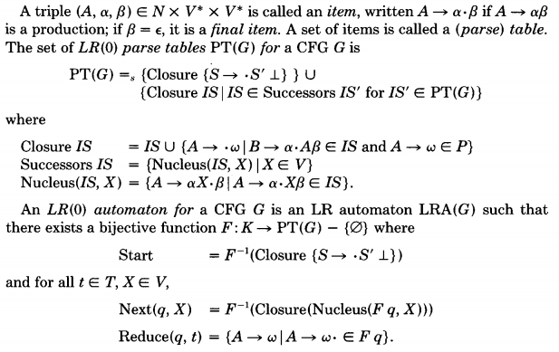

# Parser types

I have made the [racket PEG](https://docs.racket-lang.org/peg/index.html) parser library which is quite nice - kind of like a turbo charged regex system with transformations. But I want to cover one disadvantage it has compared to standard parsing techniques like LL, LR, LALR (I don't know the details of these but I'm sure everyones heard of them and knows what I mean) type parsers: It uses backtracking.

The standard parsing techniques have processed the grammar to build some kind of state transition table which parses text one token at a time, in linear time, without backtracking. This is a very nice property to have. I had a look at some existing code that implements lalr parser generators and it was quite long and complex, I also checked some papers that explain how the process works but I couldn't understand them.



So this document is my notes on trying parsing using grammar normalization instead of recursive descent (which I usually use for reading s-exps) or a peg like backtracking system.

# Grammar normalization

So forget all that, let's experiment in a way that makes sense to me. I start with the following grammar because I want to make a better parser for lisp s-expressions:

```
    (sexp --> sym)
    (sexp --> #\( sexps #\))

    (sexps -->)
    (sexps --> sexp sexps)
    
    (sym -->)
    (sym --> #\a sym)
    (sym --> #\b sym)
```

This says that a s-exp is either a symbol or open-bracket, many sexps, close-bracket. Pretty simple, it doesn't include quotation or dotted pairs but I'll add them later. I wanted to transform this into a state transition system, so any time the first bit after --> is not a character we will rewrite it with its definition. So we rewrite atom in sexp by all of its possible values:

```
    (sexp -->)
    (sexp --> #\a sym)
    (sexp --> #\b sym)
    (sexp --> #\( sexps #\))
```

and we replace sexp in the sexps parse rule by all 4 of its possible values:

```
    (sexps -->)
    (sexps --> sexps)
    (sexps --> #\a sym sexps)
    (sexps --> #\b sym sexps)
    (sexps --> #\( sexps #\) sexps)
```

so we have this grammar now:

```
    (sexp -->)
    (sexp --> #\a sym)
    (sexp --> #\b sym)
    (sexp --> #\( sexps #\))

    (sexps -->)
    (sexps --> sexps) ;; we will delete this rule, since it's trivial
    (sexps --> #\a sym sexps)
    (sexps --> #\b sym sexps)
    (sexps --> #\( sexps #\) sexps)
    
    (sym -->)
    (sym --> #\a sym)
    (sym --> #\b sym)
```

which we can start to express as a state transition system. The sexp state has 3 transitions: `ACCEPT`, `READ(#\a)` (or `#\b`) then parse `sym`, `READ(#\()` then parse sexps then a `#\)`. Every state that we are in can be left by reading a single character.

So we can try coding this up, which I did here:

https://gist.github.com/rain-1/615cec52cf9ce92c07d3f76e74da162c#file-grammar-1-rkt

by implementing it the form of the machine starts to become clear: we have a input stream of tokens which we peek at and read from. And we have a work stack that contains parse states as well as expected tokens. One thing I notice is that this is essentially the same as recursive descent but the stack is explicitly handled instead of an implicit thing that happens by recursive function calls.

# Version 2

Now I wanted to apply the same technique to a more serious parser:

```
(define g
  '((sexp --> #\a)
    (sexp --> #\' sexp)
    (sexp --> #\( sexps #\))
    (sexps -->)
    (sexps --> sexp #\. sexp)
    (sexps --> sexp sexps)))
```

Now this may not look like a 'serious' grammar for a production programming language but I think it's actually the complete grammar for scheme. the `#\'` character represents all the quotation tokens. `#\a` represents all possible atoms, strings, numbers. So you need a solid lexer before you can use this, but that's a topic for another time..

It was a bit harder to normalize this grammar manually. Rewrite sexp inside the sexps rule:

```
  '((sexp --> #\a)
    (sexp --> #\' sexp)
    (sexp --> #\( sexps #\))
    (sexps -->)
    (sexps --> #\a #\. sexp)
    (sexps --> #\' sexp #\. sexp)
    (sexps --> #\( sexps #\) #\. sexp)
    (sexps --> #\a sexps)
    (sexps --> #\' sexp sexps)
    (sexps --> #\( sexps #\) sexps)
```

then I noticed there's a new problem here that wasn't encountered in previous grammars, the same character can lead to 2 states. To address this I invented a new parse state for each ambiguity case:

```
  '((sexp --> #\a)
    (sexp --> #\' sexp)
    (sexp --> #\( sexps #\))

    (sexps -->)
    (sexps --> #\a sexp:a)
    (sexps --> #\' sexp:q)
    (sexps --> #\( sexp:b)

    (sexp:a --> #\. sexp)
    (sexp:a --> sexps)

    (sexp:q --> sexp #\. sexp)
    (sexp:q --> sexp sexps)

    (sexps:b --> sexps #\) #\. sexp)
    (sexps:b --> sexps #\) sexps)
```

and I worked away at normalizing thing and it didn't go too well. This was a mistake, a much better way to factor it out is like this:


```
  '((sexp --> #\a)
    (sexp --> #\' sexp)
    (sexp --> #\( sexps #\))

    (sexps -->)
    (sexps --> #\a sexps1)
    (sexps --> #\' sexp sexps1)
    (sexps --> #\( sexps #\) sexps1)

    (sexps1 --> #\. sexp)
    (sexps1 --> sexps)
```

now we apply a rewrite inside sexps1

```
  '((sexp --> #\a)
    (sexp --> #\' sexp)
    (sexp --> #\( sexps #\))

    (sexps -->)
    (sexps --> #\a sexps1)
    (sexps --> #\' sexp sexps1)
    (sexps --> #\( sexps #\) sexps1)

    (sexps1 -->)
    (sexps1 --> #\. sexp)
    (sexps1 --> #\a sexps1)
    (sexps1 --> #\' sexp sexps1)
    (sexps1 --> #\( sexps #\) sexps1)
```

So implementing this, with macros, I got a working parser that handles quoted expressions, nested lists, dotted lists. Seems pretty good!

https://gist.github.com/rain-1/615cec52cf9ce92c07d3f76e74da162c#file-grammar-2-rkt

# In C

I am not entirely happy with the clarity of the code I wrote to read lisp in my single_cream scheme interpreter: https://github.com/rain-1/single_cream/blob/master/src/sch3.c#L308

It works well but it's kind of ugly. So I wanted to see how this approach would look in C, I came up with this:

https://gist.github.com/rain-1/615cec52cf9ce92c07d3f76e74da162c#file-grammar-3-c

```c
		case PARSE_SEXP:
			switch(t.ty) {
			case TOKEN_ATOM:
				break;
			case TOKEN_QUOTE:
				parser_work[parser_work_top++] = (scm_token){ .ty = PARSE_SEXP };
				break;
			case TOKEN_OPEN_PAREN:
				parser_work[parser_work_top++] = (scm_token){ .ty = TOKEN_CLOSE_PAREN };
				parser_work[parser_work_top++] = (scm_token){ .ty = PARSE_SEXPS };
				break;
			default:
				die("parse sexp: unexpected token");
			}
```

It seems ok but it's a little bit odd. I haven't decided which one to go with yet.

I haven't figured out how to produce results from this type of parser yet, currently I just accept or reject with an error message. I think it would need a second stack which partial result objects are put on and then when a parse state exits several objects could be popped off and joined into one AST object.

