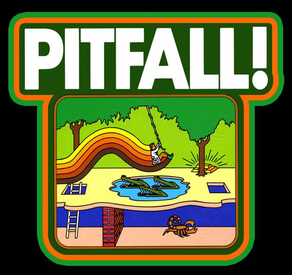
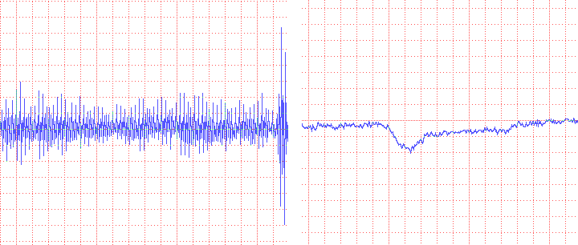
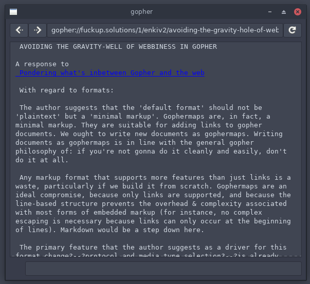

# Why did I write my programming projects?

All the software we use day to day is built on top of a foundation. I believe this foundation should be approachable and understandable to us. Otherwise we're just floating on an ocean on unknowns and aren't able to grasp it or utilize it fully. I think lots of us struggle with the strange edge cases and surprising actions of our software toolkit because of its high complexity. I've found that much of this complexity is non-essential.

I have attempted to tame some of the complexity by creating my own stripped down versions of existing tools. I have my own focus on aspects of software and design and I would love to hear other perspectives on these topics, so if you have thought about any of these things please feel free to add some comments.

## s

* [rain-1/s](https://github.com/rain-1/s)

I made the `s` lightweight shell because I don't like the complex nature of the syntax of the bash shell. I found that basic tasks like passing in a variable or filename to a command line tool are fraught with danger. When you write a bash script it may seem to work but can actually have al sorts of edge cases related to filenames with whitespace in them, things starting with a dash that gets misinterpreted as a command line flag. There are too many issues. The early design of shell is plagued with all sorts of screw-ups about escaping and quotation, today we understand these things well and could design cleaner languages. There is a clear trend in modern script languages that we want to move away from string-splatting. David wheeler has some great content on it, so does the bash wiki:

* [https://dwheeler.com/essays/filenames-in-shell.html](https://dwheeler.com/essays/filenames-in-shell.html)
* [https://dwheeler.com/essays/shellshock.html](https://dwheeler.com/essays/shellshock.html)
* [https://mywiki.wooledge.org/BashPitfalls](https://mywiki.wooledge.org/BashPitfalls)
* [https://twitter.com/roblourens/status/1128165769395597312](https://twitter.com/roblourens/status/1128165769395597312)



So I wanted to build my own shell that had regular token syntax. And that phase would be separated from the variable expansion phase. Much less surprising! I learned a few things from making this. I also implemented a nice "regions" system for memory allocation in C which you are welcome to use. A good thing that came from making a shell is getting practice with the dup/pipe stuff in order to implement pipelines like `ps | grep | wc`. The most important thing that I learned from this though was that the shell scripting situation is not going to be significantly improved by a shell alone..

The understanding I gained was that the basic UNIX tools we compose together using the shell should be more regular and machine friendly. I think UNIX command lines tools should have a completely different system of command line process and instead of using plain text as the universal interface they could use something like tab separated values or ascii delimited values. Being able to do interchange between programs with a well specified structured data format is something very valuable and helpful. Instead we build ad-hoc parsers with awk and sed and such on a daily basis.

* [https://gist.github.com/rain-1/e6293ec0113c193ecc23d5529461d322](https://gist.github.com/rain-1/e6293ec0113c193ecc23d5529461d322)
* [https://ronaldduncan.wordpress.com/2009/10/31/text-file-formats-ascii-delimited-text-not-csv-or-tab-delimited-text/](https://ronaldduncan.wordpress.com/2009/10/31/text-file-formats-ascii-delimited-text-not-csv-or-tab-delimited-text/)

People talk about how text is the universal interface in a UNIX system,  but you can't even parse the output of `ls`. It's kind of ridiculous that such a simple tool - the first one you learn about usually - violates the universal law of the system. Various projects have reimplemented the GNU coreutils - it's not a huge undertaking. If we spent the time to design a new structured data interchange system for command line tools instead of the fuzzy idea of "lines of text" I think the daily plumbing work of scripting could be much much smoother and easier.

I already see this happening a little bit. The `ip` utility can output data in json format now! Although this is perhaps not the exact direction I would have recommend, it's still progress. Paired with the `jq` tool you can work with this data very efficiently in a terminal.

* [https://lwn.net/Articles/738897/](https://lwn.net/Articles/738897/)
* [https://stedolan.github.io/jq/](https://stedolan.github.io/jq/)

In the end making `s` was a valuable experiment, but it pointed out to me that the real problem was elsewhere (the userspace tools). I don't recommend using s but the code may be good to learn from.

## makes

* [rain-1/makes](https://github.com/rain-1/makes)
* [makes/tree/master/previous-version](https://github.com/rain-1/rain-1/makes/tree/master/previous-version)

I've been critical of the whole autoreconf, automake, m4, ./configure, make toolkit for a long time. It solves a real problem, software needs configuration before being built. And to build software (written in C, C++ and many other languages) we need something that does dependency resolution, incremental builds and bunched parallelism. Make does this, but I hate using make - it can be stressful.

Make is overcomplex. It doesn't fit the UNIX philosophy of solving one task and interacting with other programs. Instead of it tries to do everything: for example it includes an incompatable reimplementation of shell, and it even has guile scheme scripting engine built into it. I felt I could make an orthogonal build engine. Now I'm aware that there are many many existing build systems, of course I reviewed them. I would say that tup is pretty interesting. I think that we're also seeing a trend where new languages have their own build tools built in (and I think it's clear why they do this instead of just making people use make).

For these reasons I decided that I had enough and created my own replacement. I was not excited about existing build systems like cmake or meson so I wanted to explore the absolute minimum viable build system. My first attempt was the "previous-version", which is simply a command line tool that tells if you file A is newer than any of files B,C,D. This "newer than?" primitive is enough to do incremental builds, you just embed your build rules into a shell script like this:

```
makes data.o \
        data.c data.h &&
        $CC $CFLAGS -o data.o data.c
```

By making that tool I learned it was slightly too simple a framework to add parallelism. I had hoped to add parallelism by waiting for files to appear but there is a race condition because compilers like gcc will open the output file before filling its contents in - it's not an atomic operation. For another process to wait until the file is "finished" isn't something you can really do. I studied some things like inotify, fnctl to try but they did not work reliably.

At that point I designed a new version of the build system based on a tab separated values file full of build rules. The tool will load all the rules and perform dependency resolution and then execute an incremental and parallel build for you. I decided to implement this tool in golang rather than C because of it's added complexity, parsing an input file and performing a graph topsort, as well as using the concurrency features of go which was an excellent help.

This tool does build on the concept of makes v1 because the idea of it is not to write the TSV rules file directly (although you can do this if you like) but the idea is to generate it using a script in any language of your choice. I used shell scripts but python or your favorite language would be fine. I made sure to prove my concept of makes by testing it out by building some exsting software projects: bash, jq, sbase. I also found that the tool can be used for other things, like maintaining a mp3 version of a directory tree with flacs in it. You can re-run it and it will only encode new flacs that haven't yet been translated to mp3.

You can have a look at these scripts (and the TSV build rule output for some of them) here:

* [https://gist.github.com/rain-1/f3434f4b12147d5ef62369e511a184de](https://gist.github.com/rain-1/f3434f4b12147d5ef62369e511a184de)

In my opinion this v2 of `makes` is excellent. For me, it totally fills the gap that vowing not to use 'make' again left. I recommend use of this tool.

I don't know what to do about the autotools situation yet though. Any ideas? One thing I'd point out is that the software configuration requirements today are less involving than back then.

## tests

* [rain-1/tests](https://github.com/rain-1/tests)

`tests` is an extremely simple script - 80 lines of code - that enables you to automatically test a command line tool using a folder full of inputs and expected outputs (or expected errors).

put simply I made this because I couldn't find anything that does this? that might sound crazy but I searched a bit and got bogged down reading about 'test anything protocol'. Every testing tool I found was very bloated - look at dejagnu for example: `wc *` says it's got 28012 lines of code in the top level dir.. that isn't even counting the source code, that's the scripts to build it and stuff. linecount . '*.exp' says it's about 17195 lines of "exp" code. All that just to run a script with different inputs and check the result?

* [https://www.gnu.org/software/dejagnu/](https://www.gnu.org/software/dejagnu/)

The kind of ratio here: 80 lines vs 17195 lines for two programs that achieve the same task is something that I've discovered is complete normal. We have a crisis of software complexity that most programmers don't even want to accept is real. I believe that all of this extra just makes it harder to get basic tasks done and incurs a consistent extra maintainership cost.


It's worth it to dump overcomplex software and find or make something clean and minimal that accomplishes the task for you.

* [https://softwarecrisis.miraheze.org/wiki/Linecount](https://softwarecrisis.miraheze.org/wiki/Linecount)

I recommend using this!

## linenoise-mob

* [rain-1/linenoise-mob](https://github.com/rain-1/linenoise-mob)

I used linenoise in my shell. It's a nice minimal tool for line editing in terminals. It lets you not use GNU readline. Unfortunately the author was very busy with a lot of other stuff, so a great deal of pull requests and github issues added up. I merged all of the "good" (judged by me) pull requests (about 200 of them!) into a forked repo. It was a lot of work.. I also included the UTF-8 patch. I hope this is a valuable contribution, others will need to join in maintaining it - and some people have!

I stole the -mob branch idea from tinycc which is very succesful.



* [https://repo.or.cz/w/tinycc.git](https://repo.or.cz/w/tinycc.git)

## tarot and single_cream

* [rain-1/tarot-compiler](https://github.com/rain-1/tarot-compiler)
* [rain-1/tarot-vm](https://github.com/rain-1/tarot-vm)
* [rain-1/single_cream](https://github.com/rain-1/single_cream)
* [https://rain-1.github.io/scheme](https://rain-1.github.io/scheme)
* [closure conversion gist](https://gist.github.com/rain-1/36c4851b7c29cf8e42f23ba6eec37be6)

I'm a fan of the scheme language and I wanted to build my own scheme from scratch, and I really wanted to do a self-hosted version that could compile itself. This was a lot harder than I imagined. I worked on it for several years before I achieved the results I wanted. The final result is good though. The source code is extremely short and simple. It builds itself very quickly (14 seconds). Most compilers are too complex to understand and take a long time to build themselves.

One of the best algorithms in the compiler is the closure conversion pass. I've put a gist link to a writeup of just that pass on its own - so that can be studied and understood separate to the rest of the compiler. I also did writeups on each compiler pass. I think these documents will be valuable to beginners learning to implement a functional language. It also has a custom scheme virtual machine written in C that everything runs on top of.

One of the main things I've realized through making this is that self-hosting your programming language implementation isn't really a beneficial thing. It's extremely "cool" but that doesn't imply it's a good software engineering practice. The "loop" you create from self hosting where the source code needs an already compiled binary introduces lots of traps and gotchas that you need to work around as well as the simple fact that you can't build the compiler in terms of something smaller. This property is called being "bootstrappable" and I think we should try to make all our compiler tools bootstrappable down to a tiny seed binary that can be audited directly. We've got ourselves into a bit of a mess with GCC toolchain needing the set of GCC and binutils binaries to build it. There is a project to repair this though!


I bootstrapped my compiler off chez scheme and then made tinyscheme capable of building it. Eventually tinyscheme broke so I wrote my own scheme interpreter in C from scratch. I think it's one of the best single file scheme implementations around because it has a working GC and proper tail calls - most single file .c schemes weren't battle tested enough to work on larger computations.

The other important thing I learned about implementing a programming language is that the actual core feature: taking an input source file and either executing it or compiling it - is only a fraction of what you need to do to make a programming language. You also need debugging and profiling features and documentation for everything. And probably a lot more..

* [https://tratt.net/laurie/blog/entries/the_bootstrapped_compiler_and_the_damage_done.html](https://tratt.net/laurie/blog/entries/the_bootstrapped_compiler_and_the_damage_done.html)
* [https://bootstrappable.org/](https://bootstrappable.org/)

I recommend using single_cream but I don't really recommend using tarot, studying it could be valuable if you want to learn compilers and PL dev.

## gopher

* [rain-1/gopher](https://github.com/rain-1/gopher)



This is my gopher client. I wanted to build a GUI gopher client that's similar to a web browser - but not built on top of web technologies. To do this I first forked cgo and added a gtk gui to it. Later I wrote an entirely new one in vala. I think that vala version works well, but I had some trouble with concurrency features (to support the spinner while a page loads). I'm grateful to the folks on the #vala IRC channel who helped me with perfecting that!

The web has become incredibly user-hostile because of advertising, tracking and bad frontend practices (unnecessary javascript frameworks). Gopher offers respite from that. I hope people don't ruin it by attempting to modernize it. I have some interest in adding some kind of markdown support to gopher (planning ahead for this is part of why I made a GUI client with GTKTextView instead of a terminal based on) but I don't have a specific plan yet, I see a lot of markdown documents on gopher so I believe this is something a lot of people would benefit from.

I think this gopher client is great. It's a pleasure to use and it's fun to checkout gopherspace. There's something realy nice about being able to do this outside of a web browser. I think it needs a "bookmarks" feature and I haven't figured out how to add that yet. I hope others will use this client and maybe even help improve it.

* [https://idlewords.com/talks/website_obesity.htm](https://idlewords.com/talks/website_obesity.htm)

# Summary

Writing software is rewarding in and of itself but I put this stuff on github and share it with the world in the hopes it can benefit others. I just don't realy know the best way to connect with others that share the same kind of aesthetics and focus in software. As far as I know there isn't a group for this anywhere.

* (s) Use structured formats for data interchange
* (s) Historical mistakes dating back to the 70s have been cemented into our fundamental tools.
* (s) We know how to do things better now, but it's hard to leap forwards in the 'free market' of libre software, we can only really make step by step changes.
* (makes) Dump software that makes you unhappy. Put your energy into technology you believe in.
* (makes) The tab separated values format is much better than it gets credit for, underused.
* (makes) You can replace (for your own use) a decades long dynasty of software with a single program you put together in a few weeks.
* (tests) Dump overcomplex software
* (tests) Two programs that do the same thing may have a 1000x size difference.
* (tarot) Self hosting shouldn't be a goal for language implementors.
* (tarot) If you're having trouble accomplishing a large goal: set lots of small goals to build up the power to work through a long slog.
* (gopher) If you like something let it be. (Don't fix what aint broke).
